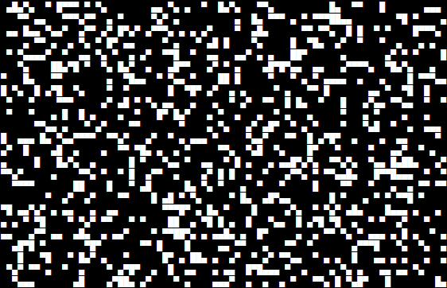

# Conway's Game of Life

The [Game of Life](https://en.wikipedia.org/wiki/Conway's_Game_of_Life), "also
known simply as Life, is a cellular automaton devised by the British
mathematician John Horton Conway in 1970". This is an implementation that
renders in the terminal.

  

"The universe of the Game of Life is an infinite, two-dimensional orthogonal
grid of square cells, each of which is in one of two possible states, alive or
dead, (or populated and unpopulated, respectively). Every cell interacts with
its eight neighbours, which are the cells that are horizontally, vertically, or
diagonally adjacent. At each step in time, the following transitions occur:

 * Any live cell with fewer than two live neighbors dies, as if by
   underpopulation.
 * Any live cell with two or three live neighbors lives on to the next
   generation.
 * Any live cell with more than three live neighbors dies, as if by
   overpopulation.
 * Any dead cell with exactly three live neighbors becomes a live cell, as if
   by reproduction.

The initial pattern constitutes the seed of the system. The first generation is
created by applying the above rules simultaneously to every cell in the seed;
births and deaths occur simultaneously, and the discrete moment at which this
happens is sometimes called a tick. Each generation is a pure function of the
preceding one. The rules continue to be applied repeatedly to create further
generations."

## Interface

By default the screen is filled with a random pattern of alive and dead cells.
Any terminal resizing will cause the automaton to be recreated, as if new. The
simulation will run by default. Control it using the following shorcuts:

 * `space`, `p` - play/pause the simulation
 * `-` - decrease tick rate (slowest is a 1024ms tick)
 * `+` - increase tick rate (fastest is a 16ms tick)
 * `s` - step to the next generation when paused
 * `q` - quit

## Building

You can build the single source file using `make`.

This project uses the
[Unicode block elements](https://en.wikipedia.org/wiki/Block_Elements) and
therefore requires the wide character version of ncurses (ncursesw). You'll
need the library and development sources from your package manager (e.g.,
`apt install libncursesw5 libncursesw5-dev`).

## Licence

Licensed under the [MIT Licence](https://opensource.org/licenses/MIT):

Copyright &copy; 2018 [Martyn Afford](https://mafford.com)

Permission is hereby granted, free of charge, to any person obtaining a copy of
this software and associated documentation files (the "Software"), to deal in
the Software without restriction, including without limitation the rights to
use, copy, modify, merge, publish, distribute, sublicense, and/or sell copies of
the Software, and to permit persons to whom the Software is furnished to do so,
subject to the following conditions:

The above copyright notice and this permission notice shall be included in all
copies or substantial portions of the Software.

THE SOFTWARE IS PROVIDED "AS IS", WITHOUT WARRANTY OF ANY KIND, EXPRESS OR
IMPLIED, INCLUDING BUT NOT LIMITED TO THE WARRANTIES OF MERCHANTABILITY,
FITNESS FOR A PARTICULAR PURPOSE AND NONINFRINGEMENT. IN NO EVENT SHALL THE
AUTHORS OR COPYRIGHT HOLDERS BE LIABLE FOR ANY CLAIM, DAMAGES OR OTHER
LIABILITY, WHETHER IN AN ACTION OF CONTRACT, TORT OR OTHERWISE, ARISING FROM,
OUT OF OR IN CONNECTION WITH THE SOFTWARE OR THE USE OR OTHER DEALINGS IN THE
SOFTWARE.
